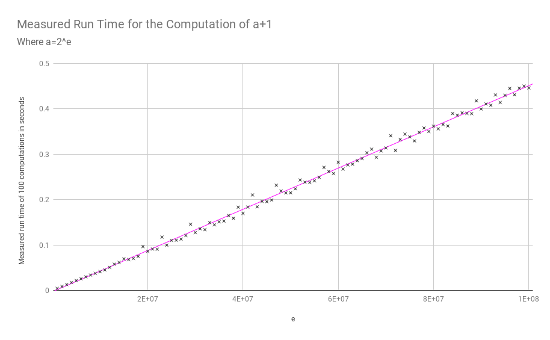

Run Time Complexity of Addition
===============================

When we analyse run time complexity we often assume that addition has a constant run time complexity. For most intents and purposes this is true. However it is actually possible to empirically show that adding two integers has a logarithmic run time complexity.

This measurement is done with python 3.6. As you can see, the measurements taken can be approximated with a linear trendline. The horizontal axis denotes the exponent of the number added, therefore the trend line is a logarithmic function of the number. This is evidence for the logarithmic run time complexity of addition in python.

The measurements were produced with the following code snippet:

.. code-block::
    python

    >>> import timeit
    >>> exponents_and_numbers = [(e, 2 ** e) for e in range(1000000, 100000001,1000000)]
    >>> for e, a in exponents_and_numbers:
    ...     time = timeit.timeit("a + 1", number=100, globals=globals())
    ...     print(f"{e},{time}")
    ...
    1000000,0.0046048509975662455
    2000000,0.008900251996237785
    3000000,0.01304833900212543
    4000000,0.01772469299612567
    5000000,0.02196525000181282
       ... etc. (full output below)

This is of course only a curiosity. In most cases we aren't concerned about the time complexity of addition, because there is an upper bound on the summands given by the fixed length binary representation in many languages.

----

Full measurement output:

1000000,0.0046048509975662455
2000000,0.008900251996237785
3000000,0.01304833900212543
4000000,0.01772469299612567
5000000,0.02196525000181282
6000000,0.025918568004271947
7000000,0.03014601299946662
8000000,0.034003839995421004
9000000,0.0377801479990012
10000000,0.04160203599894885
11000000,0.045408760001009796
12000000,0.05104912399838213
13000000,0.05805147699720692
14000000,0.061770975997205824
15000000,0.0697578569961479
16000000,0.06819817399809835
17000000,0.0705251409963239
18000000,0.07525884299684549
19000000,0.09669361900159856
20000000,0.08627759399678325
21000000,0.09135574800166069
22000000,0.09091242300200975
23000000,0.11756965400127228
24000000,0.09974519399838755
25000000,0.11022398999921279
26000000,0.11062240100000054
27000000,0.1130430300036096
28000000,0.12108740099938586
29000000,0.14570943899889244
30000000,0.12765768600365845
31000000,0.13591419700242113
32000000,0.13402059399959398
33000000,0.14948143099900335
34000000,0.14474961000087205
35000000,0.15138064499478787
36000000,0.15276742199785076
37000000,0.1650242600007914
38000000,0.15891463599837152
39000000,0.183220844999596
40000000,0.16971650900086388
41000000,0.18363872899499256
42000000,0.2103473449969897
43000000,0.18435902999772225
44000000,0.19611995200102683
45000000,0.195641300000716
46000000,0.1991369030001806
47000000,0.2315747789980378
48000000,0.21913841600326123
49000000,0.21491183000034653
50000000,0.21512371599965263
51000000,0.22394837899628328
52000000,0.243175864998193
53000000,0.23841078599798493
54000000,0.2378589829968405
55000000,0.24150258299778216
56000000,0.2489831439961563
57000000,0.2709679270046763
58000000,0.2619394180001109
59000000,0.25759358199866256
60000000,0.2820873689997825
61000000,0.26731415199901676
62000000,0.2763633169961395
63000000,0.27798206500301603
64000000,0.285748207999859
65000000,0.29057768100028625
66000000,0.30313587399723474
67000000,0.31095236299734097
68000000,0.293012815003749
69000000,0.3071876739995787
70000000,0.3137716490018647
71000000,0.3407441919989651
72000000,0.30825429799733683
73000000,0.33228749800036894
74000000,0.3441442460025428
75000000,0.33823640999617055
76000000,0.32918366900412366
77000000,0.3479212960010045
78000000,0.35767969700100366
79000000,0.34994568199908827
80000000,0.3615980690010474
81000000,0.3558162059998722
82000000,0.36531711000134237
83000000,0.36197978199925274
84000000,0.38937018899741815
85000000,0.38583297599689104
86000000,0.39115245600260096
87000000,0.38970026199967833
88000000,0.38919830200029537
89000000,0.41744625299907057
90000000,0.3993787279978278
91000000,0.4105618410030729
92000000,0.4076409619956394
93000000,0.43036511500395136
94000000,0.4137870259946794
95000000,0.42933206900488585
96000000,0.4446215329953702
97000000,0.43093036199570633
98000000,0.4451171120017534
99000000,0.4497541149976314
100000000,0.4457786359998863
